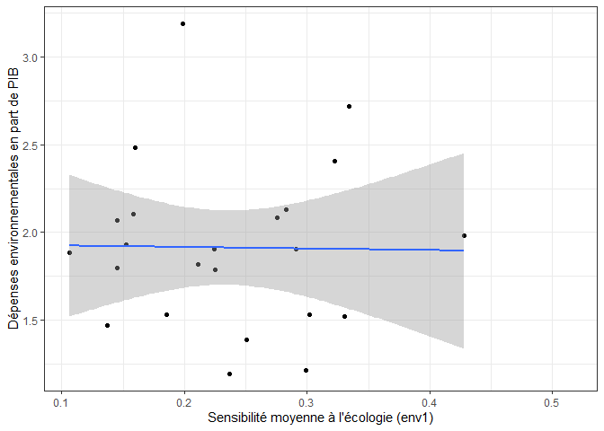
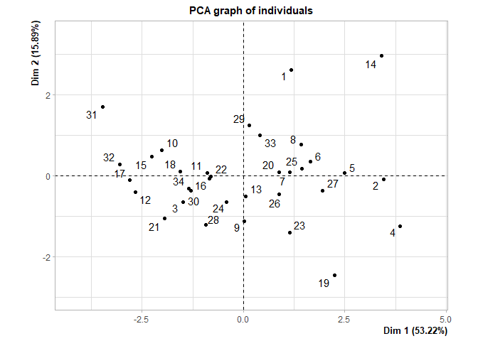
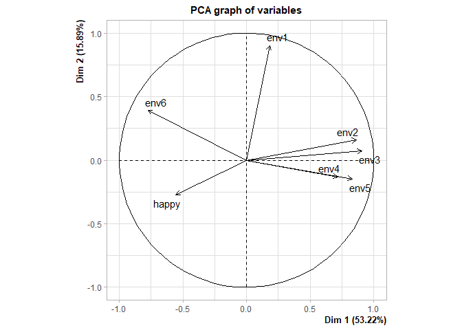
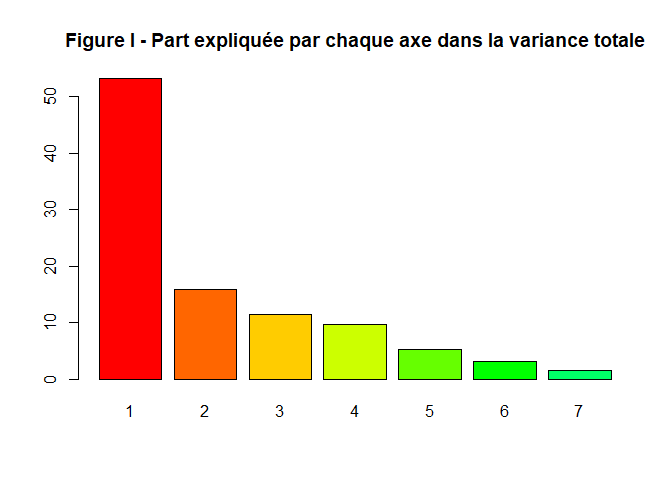
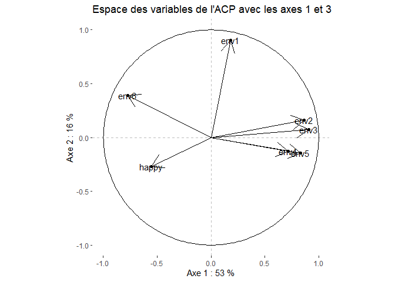
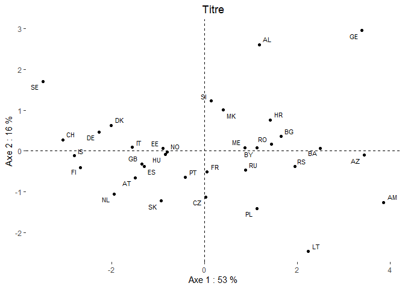
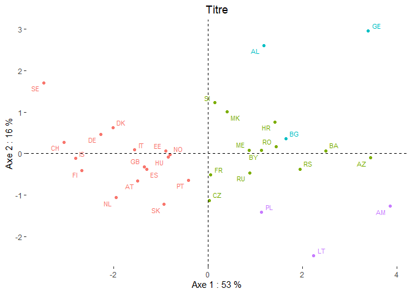
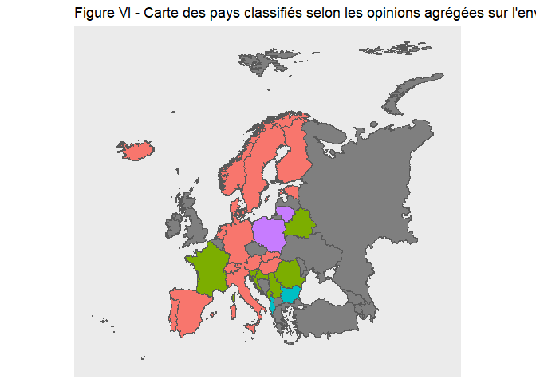

Conscience écologique et dépenses publiques en faveur de l’environnement
================
Quentin Merrien et Catherine Berleur
13/04/2021

-   [Régression linéaire](#régression-linéaire)
-   [Including Plots](#including-plots)

Pour rappel : v7 : Tout bien considéré, diriez-vous que vous êtes… (p.3
de ZA7500\_q\_fr.pdf) 1 – Très heureux 2 – Assez heureux 3 – Pas très
heureux 4 – Pas heureux du tout

à finir. Je le ferais.

Point d’analyse intéressant : une fois les paramètres économétriques
estimés, on peut essayer d’expliquer/interpréter les situations
contrefactuelles, c’est-à-dire celles qui s’éloignent le plus de
l’estimation.

## Régression linéaire

<!-- -->

## Including Plots

<!-- --><!-- -->

    ## Reading layer `Europe' from data source `C:\Users\quent\Desktop\ENS Paris-Saclay\1A\1S2\Econométrie\TDs\Bases de données\Documents\projet-econometrie\Europe\Europe.shp' using driver `ESRI Shapefile'
    ## Simple feature collection with 54 features and 2 fields
    ## geometry type:  MULTIPOLYGON
    ## dimension:      XY
    ## bbox:           xmin: -31.26575 ymin: 32.39748 xmax: 69.07032 ymax: 81.85737
    ## geographic CRS: WGS 84

<!-- --><!-- --><!-- --><!-- --><!-- -->
